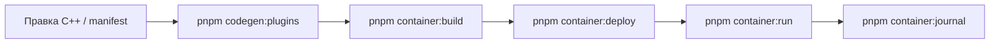
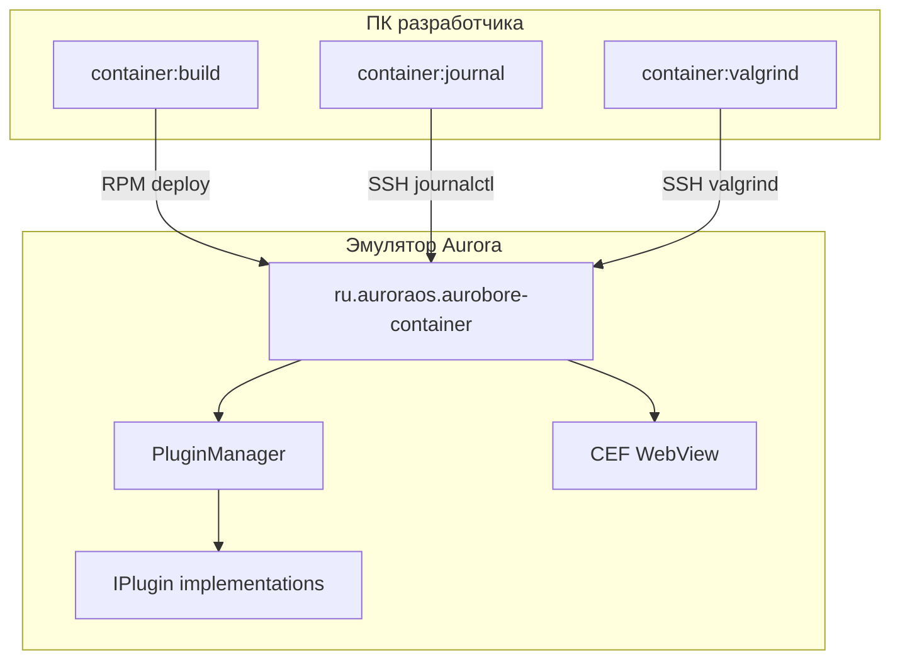

# Отладка нативной части (C++/Qt, плагины)

Операционный гайд для разработки `runtime/*`, `plugins/*/native` и `native-sdk` на эмуляторе Aurora.
Web-слой (CEF DevTools) — отдельно: [web-debugging.md](web-debugging.md).

## Быстрый цикл разработки плагина



| Шаг | Команда | Когда |
|---|---|---|
| Только manifest / генератор | `pnpm codegen:plugins` | изменили `plugin.manifest` или `@aurobore/build` |
| Сборка RPM | `pnpm container:build` | изменили C++, QML, `native-sdk` |
| Установка на эмулятор | `pnpm container:deploy` | RPM уже собран |
| Прогон M1–M3 | `pnpm container:run` | после deploy |
| Живой лог | `pnpm container:journal` | параллельно с ручными действиями в UI |
| Полная регрессия | `pnpm container:all` | перед merge |

Workflow плагинов и staging: [native-plugin-guide.md](native-plugin-guide.md).

## Команды dev-toolkit

Из корня репозитория (нужен `tools/aurora/local.env`):

| Команда | Действие |
|---|---|
| `pnpm container:journal` | `journalctl -f` с фильтром `aurobore-*` (Ctrl+C для выхода) |
| `pnpm container:journal -- -n 200` | снимок последних 200 строк journal (без follow) |
| `pnpm container:logs` | `tail -f /tmp/container.log` (stdout процесса) |
| `pnpm container:stop` | остановить `ru.auroraos.aurobore-container` |
| `pnpm container:restart` | stop + `container:run` |
| `pnpm container:ssh` | интерактивная SSH-сессия на эмулятор |
| `pnpm container:valgrind` | запуск под Valgrind (медленно; только dev) |
| `pnpm container:valgrind:fetch` | скачать `/tmp/valgrind-container.log` на ПК |

Эквивалент: `node tools/aurora/native-debug.mjs <команда>`.

## Логи и маркеры

### Префиксы в journal

| Префикс | Источник |
|---|---|
| `[aurobore-container]` | bootstrap, asset loader, CEF |
| `[aurobore-bridge]` | BridgeRouter, invoke/events |
| `[aurobore-plugin]` | PluginManager, регистрация, invoke/cancel, исключения |
| `[aurobore-web]` | web-слой (если включён) |
| `[aurobore-scope]` | permissions / scope validator |

`PluginManager` перехватывает `std::exception` в `invoke`/`cancel` и пишет в journal — удобно
отлаживать плагин без GDB.

### Маркеры успеха

```
[aurobore-container] M1 OK: aurobore-app loaded, lifecycle ready, SPA back works
[aurobore-container] M2 OK: bridge invoke, events, stream verified
[aurobore-container] M3 OK: plugins registered, Device + Storage verified
[aurobore-plugin] registered <Name> v…
```

`container:run` ждёт **M3 OK** (таймаут `POC_RUN_WAIT_SEC` в `local.env`).

### Verbose Qt-логи

В `tools/aurora/local.env` раскомментируйте или добавьте:

```env
AUROBORE_QT_LOGGING_RULES=*.debug=false;qt.*.debug=false
```

Примеры правил:

```env
# всё от aurobore-префиксов
AUROBORE_QT_LOGGING_RULES=aurobore.*.debug=true

# сеть Qt (TLS, HTTP)
AUROBORE_QT_LOGGING_RULES=qt.network.*.debug=true
```

Переменная передаётся в процесс при `container:run` / `container:restart`.

## Интерактивная отладка (GDB)

Приложения Aurora работают в **песочнице (Firejail)**. Обычный `gdb ./app` на устройстве часто
не подходит — используйте штатные средства SDK:

| Инструмент | Назначение |
|---|---|
| **GDB** | breakpoints, backtrace, inspect |
| **runtime-manager-tool** | отладка sandbox-приложений |
| **ADT** | деплой и управление с ПК |

См. [docs/aurora/tooling.md](../aurora/tooling.md), [sandbox-and-permissions.md](../aurora/sandbox-and-permissions.md),
[официальную документацию SDK](https://developer.auroraos.ru/doc/sdk/tools).

### Окружение при ручном запуске

Если запускаете бинарник вручную по SSH (не через `container:run`), нужны те же переменные, что в
`tools/aurora/run-container.sh`:

```bash
export XDG_RUNTIME_DIR=/run/user/100000
export WAYLAND_DISPLAY=/run/display/wayland-0
export QT_QPA_PLATFORM=wayland
export LD_LIBRARY_PATH=/usr/lib/cef:${LD_LIBRARY_PATH:-}
/usr/bin/ru.auroraos.aurobore-container
```

Без Wayland и CEF приложение упадёт до того, как вы дойдёте до плагина.

## Утечки памяти (Valgrind)

### Через dev-toolkit

1. Соберите и установите свежий RPM: `pnpm container:build && pnpm container:deploy`
2. Запустите Valgrind:

   ```powershell
   pnpm container:valgrind
   ```

3. На эмуляторе воспроизведите сценарий (откройте приложение, вызовите методы плагина, закройте).
4. После завершения процесса скачайте отчёт:

   ```powershell
   pnpm container:valgrind:fetch
   ```

   Лог появится в `%USERPROFILE%\aurobore-spike\valgrind-container.log` (или `~/aurobore-spike/…`).

Дополнительные флаги Valgrind — через `VALGRIND_OPTS` в `local.env`:

```env
VALGRIND_OPTS=--leak-check=full --show-leak-kinds=all --track-origins=yes --gen-suppressions=all
```

### Ограничения

- Valgrind **сильно замедляет** приложение; CEF/WebView даёт много шума от Chromium.
- Фильтруйте стеки по своему коду: `PluginManager`, `*Plugin.cpp`, `AssetSchemeServer`, `native-sdk`.
- AddressSanitizer в CMake проекта **не настроен** — на Aurora с CEF надёжнее Valgrind для полного процесса.

### Qt ownership в Aurobore

Плагины создаются через `new FooPlugin(router)` и хранятся в `PluginManager`; при уничтожении —
`qDeleteAll(m_plugins)`. Дочерние `QObject` с `parent` (таймеры, `StreamPublisher`) освобождаются
автоматически.

**Частые источники утечек в плагинах:**

| Паттерн | Риск |
|---|---|
| `new QTimer` / `QNetworkAccessManager` без parent | утечка при пересоздании плагина |
| Стрим без `cancel(id)` / `complete()` | таймер крутится вечно |
| `new` без parent и без поля класса | «сирота» |
| Лямбда `[this]` на уничтоженный объект | use-after-free (не всегда видно в Valgrind сразу) |

Проверка: в `cancel()` останавливайте все таймеры и сбрасывайте subscription id; для стримов смотрите
`EchoPlugin` и `StreamPublisher` как референс.

## Другие инструменты SDK

| Инструмент | Когда |
|---|---|
| **strace** | зависания, `permission denied`, странные syscall в песочнице |
| **Svace** | статический анализ до запуска (CI) |
| **CEF DevTools** | только JS/DOM в WebView — [web-debugging.md](web-debugging.md) |

На эмуляторе по SSH:

```bash
# пример: трассировка открытия файлов
strace -f -e trace=openat,access -p $(pgrep -f ru.auroraos.aurobore-container)
```

## Сценарии по типу бага

### Плагин не регистрируется

1. `pnpm container:journal -- -n 80` — ищите `[aurobore-plugin] skip …`
2. Проверьте `bridgeProtocol: 1` в manifest, factory `createXxxPlugin` в `.cpp`
3. `pnpm codegen:plugins` + `container:build`

### invoke падает / возвращает RUNTIME_PLUGIN_ERROR

1. `container:journal` во время вызова из demo SPA
2. Стек исключения в journal (`[aurobore-plugin] Foo.bar exception: …`)
3. При необходимости GDB к процессу на `PluginManager::dispatchInvoke`

### Стрим не останавливается / растёт память

1. Проверьте реализацию `cancel(id)` в плагине
2. `container:valgrind` + сценарий start stream → cancel → закрыть app
3. Убедитесь, что `StreamPublisher::complete()` / `cancel()` вызываются

### Asset loader / WebView

1. `container:logs` — stderr контейнера
2. `[aurobore-container] AssetSchemeServer` в journal
3. Web-слой отдельно: CEF DevTools

## Связь слоёв



## См. также

- [native-plugin-guide.md](native-plugin-guide.md) — цикл разработки, codegen, Qt-подводные камни
- [adding-a-plugin.md](adding-a-plugin.md) — чеклист нового плагина
- [tools/aurora/README.md](../../tools/aurora/README.md) — все команды dev-toolkit
- [runtime/native-sdk/README.md](../../runtime/native-sdk/README.md) — контракт `IPlugin`
- [docs/aurora/tooling.md](../aurora/tooling.md) — GDB, Valgrind, Svace в SDK
