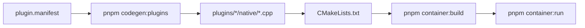

# Разработка плагинов и нативного контейнера (M3+)

Операционный гайд для разработчиков платформы Aurobore. Архитектурный контракт — в
[plugin-api.md](../plugins/plugin-api.md) и [ADR-003](../adr/ADR-003-plugin-api.md); здесь — **workflow на реальном репо**.

## Поток изменений

Быстрый путь для нового core-плагина: `aurobore plugin create <name>` — создаёт `./plugins/<name>/`
(манифест, native stub, package.json, README) и в монорепо патчит `PLUGIN_NAMES` + `CMakeLists.txt`.



## Что менялось — что запускать

| Изменения | Команды |
|---|---|
| Только `plugin.manifest` или генератор в `@aurobore/build` | `pnpm codegen:plugins` → `pnpm test` |
| Нативный C++ плагина / `native-sdk` / `bridge-native` | `pnpm container:build` (codegen вызывается автоматически, с пропуском если manifest не менялся) |
| Только `runtime/container/html/` или QML | `pnpm container:build` → deploy/run |
| Только JS в `packages/bridge-js` | `pnpm --filter @aurobore/bridge-js build` + пересборка контейнера (бандл копируется в `html/js/`) |
| Полная проверка на эмуляторе | `pnpm container:all` (~5 мин) |
| RPM уже собран, нужен только прогон | `pnpm container:deploy` + `pnpm container:run` |

**Без эмулятора** перед нативной сборкой: `pnpm test`, `pnpm typecheck`, `pnpm codegen:plugins`.

## Staging при `container:build`

На Windows build engine Aurora SDK (Docker) видит только `%USERPROFILE%` и `C:\AuroraOS`.
Оркестратор копирует исходники в staging:

```
%USERPROFILE%\aurobore-spike\
├── aurobore-container/    ← cwd для sfdk build
├── bridge-native/         ← extraSync (sibling, не внутри container)
├── native-sdk/
└── plugins/
```

Поэтому в [runtime/container/CMakeLists.txt](../../runtime/container/CMakeLists.txt) пути к плагинам —
`../plugins/...` (относительно `aurobore-container/`), **не** `../../plugins` из корня монорепо.

`container:build` выполняет: codegen (если нужен) → sync 4 деревьев → `sfdk build` → RPM.

## Кодогенерация

```powershell
pnpm codegen:plugins
```

Генерирует (не редактировать вручную):

| Артефакт | Назначение |
|---|---|
| `plugins/<name>/generated/index.js` | JS-обёртка плагина |
| `plugins/<name>/generated/index.d.ts` | TypeScript-типы |
| `runtime/container/generated/PluginRegistry.{h,cpp}` | Реестр плагинов для native |
| `runtime/container/html/js/aurobore-plugins.js` | `window.Aurobore.Device`, `Aurobore.__plugins` |

Список плагинов — константа `PLUGIN_NAMES` в
[packages/build/scripts/codegen-plugins.mjs](../../packages/build/scripts/codegen-plugins.mjs).

`container:build` вызывает codegen автоматически; при неизменных манифестах и генераторе шаг
пропускается (см. `.codegen-plugins.stamp` в корне репо).

## Маркеры успеха в journal эмулятора

| Маркер | Что проверяет |
|---|---|
| `M1 OK: aurobore-app loaded, lifecycle ready, SPA back works` | Runtime, asset loader, SPA |
| `M2 OK: bridge invoke, events, stream verified` | Echo ping/stream/events |
| `M3 OK: plugins registered, Device + Storage verified` | PluginManager + codegen JS |
| `[aurobore-plugin] registered <Name>` | Каждый плагин при старте |

Полный цикл: `pnpm container:all`. Только запуск: `pnpm container:run` (ждёт M3 OK в journal).

## Qt/C++ — типичные ошибки (M3)

### Factory в `.cpp` плагина

`PluginRegistry.cpp` **не** делает `return new FooPlugin(router)` — только вызывает фабрику:

```cpp
// plugins/foo/native/FooPlugin.cpp
IPlugin *createFooPlugin(BridgeRouter *router) {
    return new FooPlugin(router);
}
```

Фабрика объявлена в сгенерированном `PluginRegistry.h`. Полное определение класса плагина должно
быть видно в `.cpp` плагина, иначе компилятор не сможет привести `FooPlugin*` к `IPlugin*`.

### Shadowing `router()`

Не называйте параметр конструктора `router`, если в базовом классе есть метод `router()`:

```cpp
// Плохо: в lambda [this] вызов router() может конфликтовать с параметром
EchoPlugin::EchoPlugin(BridgeRouter *router, QObject *parent)

// Хорошо
EchoPlugin::EchoPlugin(BridgeRouter *bridgeRouter, QObject *parent)
    : IPlugin(bridgeRouter, parent) { ... }

// В lambda используйте this->router()
this->router()->emitStream(...);
```

### `Q_OBJECT` на базовом `IPlugin`

Не ставьте `Q_OBJECT` на абстрактный `IPlugin` без отдельного moc-файла. `Q_OBJECT` остаётся на
конкретных плагинах (например `EchoPlugin`), где нужны сигналы/слоты.

### Не редактировать `generated/`

Любое изменение API начинается с `plugin.manifest` → `pnpm codegen:plugins`.

## Permissions

На M3 список granted permissions задаётся в `main.cpp` (`setGrantedPermissions`).
Агрегация permissions в `.desktop` — **M4** (`aurobore.config` + build).

## Flutter-референс (platform-код Авроры)

При реализации или доработке native-плагина (особенно Camera, Geolocation, Notifications, Share, Sensors)
сначала проверьте каталог [Flutter community plugins](https://hub.mos.ru/auroraos/flutter/flutter-community-plugins)
(в Cursor — `@flutter-community-plugins`).

**Если аналог есть в каталоге** — изучите исходники **до** написания своего `*Plugin.cpp`:

| Что смотреть | Зачем |
|---|---|
| Platform implementation (C++/Qt, `linux/`, native channel) | Какие API ОС Авроры реально вызываются |
| Permissions и зависимости в `.spec` / CMake | Что декларировать в `plugin.manifest` и RPM |
| Обработка ошибок и отмены UI | Коды `*_UNAVAILABLE`, `*_CANCELLED` в нашем манифесте |

Не копируйте Dart/MethodChannel-обвязку — переносите **логику доступа к ОС** в `IPlugin::invoke` /
`cancel` / `emitStream` / `emitEvent`. Контракт Aurobore — [plugin-api.md](../plugins/plugin-api.md);
план доработки A3-плагинов — [alpha-plugins-plan.md](../alpha-plugins-plan.md).

## См. также

- [native-debugging.md](native-debugging.md) — journal, Valgrind, GDB, команды `container:journal` / `container:valgrind`
- [adding-a-plugin.md](adding-a-plugin.md) — пошаговый чеклист
- [runtime/native-sdk/README.md](../../runtime/native-sdk/README.md) — контракт `IPlugin`
- [tools/aurora/README.md](../../tools/aurora/README.md) — команды dev-toolkit
