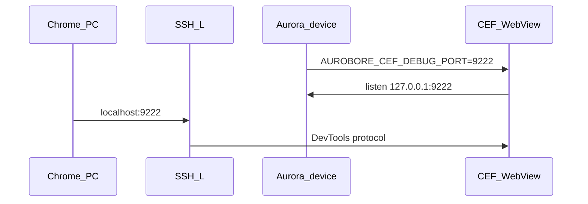

# Отладка web-слоя (CEF DevTools)

Встроенный WebView на ОС Аврора использует **CEF (Chromium)**. Для инспекции DOM, консоли и сети
нужны флаги `--remote-debugging-port` и `--remote-allow-origins` в `InitBrowser`. В Aurobore они
включаются **opt-in** через переменную окружения `AUROBORE_CEF_DEBUG_PORT` на устройстве.

> Не путать с «Отладка в браузере» из документации OMP (`ru.omp.browserpwa`) — здесь речь о
> **вашем** RPM с `WebViewItem`.

## Быстрый старт (demo-приложение)

Из каталога проекта с `aurobore.config.json`:

```powershell
aurobore dev
```

По умолчанию:

1. Собирается dev-контейнер с entry URL dev server.
2. На устройстве/эмуляторе приложение стартует с `AUROBORE_CEF_DEBUG_PORT=9222`.
3. Поднимается SSH-туннель `localhost:9222` → устройство `127.0.0.1:9222`.
4. В консоли печатаются шаги для `chrome://inspect`.

Отключить: `aurobore dev --no-cef-debug`. Другой порт: `aurobore dev --cef-debug-port 9230`.

## Chrome на ПК

1. Откройте `chrome://inspect` (не вкладку `http://localhost:9222` — в CEF 100+ landing deprecated).
2. **Configure** рядом с «Discover network targets» → добавьте `localhost:9222`, если нет в списке.
3. Запустите приложение с WebView — в **Remote Target** появится страница (например `https://127.0.0.1:…/index.html`).
4. **inspect** → DevTools.

Проверка туннеля на Windows:

```powershell
curl http://localhost:9222/json/version
```

## Эмулятор (разработка платформы)

Для монорепо без `aurobore dev`:

1. Пересоберите контейнер после изменений в `runtime/container/src/main.cpp`:

   ```powershell
   pnpm container:build
   ```

2. В [`tools/aurora/local.env`](../../tools/aurora/local.env) раскомментируйте:

   ```env
   AUROBORE_CEF_DEBUG_PORT=9222
   ```

3. Деплой и запуск:

   ```powershell
   pnpm container:deploy
   pnpm container:run
   ```

4. **Вручную** поднимите SSH-туннель (отдельное окно PowerShell):

   ```powershell
   ssh -i C:\AuroraOS\vmshare\ssh\private_keys\sdk -N -L 9222:127.0.0.1:9222 -p 2223 defaultuser@127.0.0.1
   ```

5. `chrome://inspect` как выше.

Проверка на эмуляторе (после запуска приложения):

```bash
curl -s http://127.0.0.1:9222/json/version
# или
ss -lntp | grep 9222
```

## Физическое устройство

Тот же механизм. SSH-цель задаётся в `.aurobore/local.env` проекта или `~/.aurobore/local.env`:

```env
EMULATOR_SSH_HOST=192.168.1.42
EMULATOR_SSH_PORT=22
EMULATOR_SSH_KEY=C:\path\to\device\key
EMULATOR_SSH_USER=defaultuser
```

Требования:

- Устройство в режиме разработчика, SSH доступен с ПК (Wi‑Fi / USB).
- `aurobore dev` поднимает туннель на те же `EMULATOR_SSH_*` (имя переменных историческое).

Туннель вручную:

```powershell
ssh -i <key> -N -L 9222:127.0.0.1:9222 -p 22 defaultuser@<device-ip>
```

## Как это устроено

| Компонент | Поведение |
|-----------|-----------|
| [`runtime/container/src/main.cpp`](../../runtime/container/src/main.cpp) | Читает `AUROBORE_CEF_DEBUG_PORT`, добавляет CEF flags в `InitBrowser` |
| Run-script на устройстве | `export AUROBORE_CEF_DEBUG_PORT=…` перед `nohup /usr/bin/<appId>` |
| `aurobore dev` | Порт 9222 по умолчанию + авто SSH `-L` |
| Prod / `aurobore run` | Без переменной — DevTools-сервер не поднимается |



## Troubleshooting

| Симптом | Что проверить |
|---------|----------------|
| `chrome://inspect` пустой | Пересобран ли RPM после правки `main.cpp`; задан ли `AUROBORE_CEF_DEBUG_PORT` при старте |
| `curl localhost:9222` на Windows fails | SSH-туннель не запущен или порт занят |
| Порт не слушает на устройстве | `journalctl` при старте; приложение с WebView запущено |
| Inspect подключается и рвётся | Нужен `--remote-allow-origins=*` (уже в коде для Aurora 5.2 / CEF 125+) |
| Смотрите не то приложение | `container:run` — dev-контейнер; demo — отдельный RPM (`aurobore run`) |
| `localhost:9222 is busy` | Закройте другой `ssh -L` или `--cef-debug-port` |

## Безопасность

Не задавайте `AUROBORE_CEF_DEBUG_PORT` в production-сборках и на пользовательских устройствах.
Порт открывает полный доступ к содержимому WebView с машины, имеющей SSH-доступ к loopback устройства.

## См. также

- [tools/aurora/README.md](../../tools/aurora/README.md) — dev-toolkit, SSH к эмулятору
- [runtime/container/README.md](../../runtime/container/README.md) — структура контейнера
- [architecture/dev-server.md](../architecture/dev-server.md) — dev server и HMR
